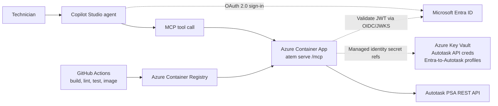

# atem — AutoTask EasyMode

A terminal-friendly, **AI-driveable** wrapper around the Autotask PSA REST API.

`atem` does two things:

1. Keeps **loose local work timers** — start one when you begin on a customer,
   pause/switch as you jump between tasks, stop when you're done. You don't have
   to log to the second; the timer produces a *suggested* number of hours that
   you confirm or override.
2. Turns that into **Autotask tickets, time entries, and reports** through a
   read-only-friendly JSON interface that an AI agent (e.g. Claude Code) can call
   on your behalf.

Every command prints a single JSON object, and everything that writes to
Autotask supports `--dry-run`.

## The workflow it's built for

You tell your AI assistant what you're doing in plain language; it runs `atem`:

> **You:** "Jag börjar med Acme Corp nu och gör deras script som mappar upp
> importfält i Excel."

```console
$ atem timer start --company acme --title "Script: mappa importfält (Excel)"
```

…creates a ticket on the right customer and starts the timer. Later:

> **You:** "Nu är jag klar — det blev ungefär 2 timmar, fick ihop mappningen men
> fick bråka med datumformaten."

```console
$ atem timer stop --hours 2 --close \
    --note "Byggde Excel-mappning för importfält; löste datumformat-strul."
```

…logs the time entry on the ticket and closes it. And when the manager asks:

> **You:** "Kunden vill ha en sammanfattning av allt jag gjort i projektet."

```console
$ atem report --company acme --from 2026-02-01 --to 2026-05-31 --format md
```

…pulls every ticket + time entry + note for that customer and hands back
structured JSON (plus a Markdown summary) ready to drop into the customer's AI.

## Build

Requires Go 1.23+ (developed on 1.26).

```console
$ go build -o atem ./        # or: go install ./...
```

## Configure

You need an Autotask API user **with write permission** (a read-only user can
only run lookups and reports).

Credentials resolve from environment variables first, then the config file.
Prefer env vars for the secret:

```pwsh
$env:ATEM_USERNAME = "yourapiuser@example.com"
$env:ATEM_SECRET = "••••••••"
$env:ATEM_INTEGRATION_CODE = "YOURINTEGRATIONCODE"
```

Then set the org-specific defaults (these differ per Autotask instance). Run
`atem config doctor` first — it verifies the credentials and zone and lists your
actual status / priority / queue / work-type IDs so you don't have to guess:

```console
$ atem config doctor                        # verify + list your org's IDs
$ atem resource search "Alex Example"       # find YOUR resourceId (who time is logged as)
$ atem config set resourceId 12345

$ atem config set queueId 8                  # default queue for new tickets
$ atem config set billingCodeId 14           # work type for time entries
$ atem config set ticketStatusNew 1
$ atem config set ticketStatusComplete 5

$ atem company search "Acme"                 # find a companyID...
$ atem company alias acme 0                   # ...and save a friendly alias
$ atem config show                            # review everything (secrets redacted)
```

Prefer a GUI? `atem ui` opens a local web panel (127.0.0.1) to edit and verify
the same config — with a show/hide toggle for the secret, and a **Verify** button
that runs `config doctor` and loads your org's queue/status/work-type IDs into
pick-lists. Nothing leaves your machine.

Config and timer state live in `%APPDATA%\atem\` (Windows) /
`~/.config/atem/` (Linux/macOS).

For the least-privilege API permissions and the exact ticket/time-entry field
requirements (role id, start/stop times, work-type handling, company id `0`),
see **[docs/AUTOTASK.md](docs/AUTOTASK.md)**.

## Commands

```
config   doctor | show | set <key> <value>
company  search <query> | alias <name> <companyID>
resource search <name|email>
ticket   search [--company <a|id>] <text> [--limit N]
         issue-types
         create --company <a|id> --title "..." --desc "..."
                [--issue-type <id>] [--sub-issue-type <id>] [--dry-run]
         show <id>
         close <id> [--dry-run]
timer    start --company <a|id> [--title] [--desc] [--ticket <id>] [--no-ticket]
               [--note] [--keep-others] [--dry-run]
         status
         note [session] <text>
         pause | resume | switch [session]
         stop [session] [--hours X] [--date YYYY-MM-DD] [--note "..."] [--close] [--dry-run]
time     add (--ticket <id> | --company <a|id>) [--title] [--desc]
             [--issue-type <id>] [--sub-issue-type <id>] --windows "11-12,13-15"
             [--date YYYY-MM-DD] [--note] [--close] [--dry-run]
report   [--company <a|id>] [--match <text>] [--ticket <id>]
         [--from YYYY-MM-DD] [--to YYYY-MM-DD] [--format json|md] [--limit N] [--out FILE]
ui       [--port N] [--no-open]    open a local config panel in your browser
describe                          JSON of every command/flag (agent self-description)
mcp                               run as an MCP server over stdio (tools = commands)
help | version
```

Notes:
- A timer is a local session (`s1`, `s2`, …). Multiple can be open; only running
  ones accrue time, so `pause`/`switch` lets you jump between customers.
- `timer stop` uses the measured elapsed time unless you pass `--hours`; pass
  `--date YYYY-MM-DD` to backdate the entry.
- `time add` logs work you didn't run a live timer for. Each `--windows` range
  becomes its own time entry with real start/end times, so split work like
  `--windows "11-12,13-15"` is recorded as the actual windows (1 h + 2 h) instead
  of one merged 3 h block. Per-window notes via `--windows "11-12=did X,13-15=did Y"`;
  otherwise `--note` is applied to each.
- `ticket issue-types` lists the active Autotask issue type and sub-issue type
  picklists. Most new tickets should be classified with those IDs via
  `ticket create` or `time add` when it creates a new ticket via `--company`;
  omitting them should be the exception. Sub-issue types are parented to one issue
  type; agents should ask the user when the available context is ambiguous rather
  than guessing a category.
- Use `--dry-run` on any write to preview the exact payload first.
- `report --match <keyword>` finds tickets by title keyword (across the whole
  account, or a single `--company`) and aggregates them in one call — ideal for a
  project summary, e.g. `atem report --match migration --format md`.
- `--out report.md` saves the report to a file (markdown when `--format md`).
  Report output contains customer data — write it outside this repo (or keep it
  gitignored); never commit it.
- `report` also returns a `flagged` list (JSON only, never the markdown) of
  entries worth itemizing before sending to a customer, each with a `reason`:
  `thin` (over `flagHoursOver` h — default 5 — with a note under `flagNotesUnder`
  chars — default 80) or `large` (at least `flagHoursAlways` h — default 12 —
  regardless of note). Tune with `atem config set flagHoursOver 8`,
  `flagNotesUnder 120`, `flagHoursAlways 16`.

## Driving atem from an AI agent (MCP)

`atem` is self-describing so an agent never has to guess the command surface:

- `atem describe` prints a JSON catalog of every command, flag (type, required,
  default), and example. No config needed.
- `atem mcp` runs an [MCP](https://modelcontextprotocol.io) server over stdio,
  exposing each command as a tool with a typed input **and** output schema
  (read-only and destructive commands are annotated; tool results include
  `structuredContent`). It also serves **resources** (`atem://describe`,
  `atem://config`) and **prompts** (`log_day`, `weekly_report`) that bake in
  atem's conventions. Register it once and the tools appear to the agent
  automatically:

  ```json
  { "mcpServers": { "atem": { "command": "atem", "args": ["mcp"] } } }
  ```

  Use the absolute path to the built binary if `atem` isn't on `PATH` (e.g.
  `C:\\path\\to\\atem.exe`). For a Claude Code project, this goes in a `.mcp.json`
  at the repo root — which is gitignored here because the path is machine-specific.
  The server runs the built binary, so rebuild (`go build -o atem.exe .`) after
  changing commands for the tools to reflect them.

`describe`, the MCP tool list, and even `atem help` are all generated from the
same command registry as the CLI dispatch; output schemas are generated by
reflection from the result structs the handlers return. So nothing in the
agent-facing surface can drift from what `atem` actually does. MCP tool calls run
the same handlers (and the same `--dry-run`/write-guards) as the CLI.

### Remote MCP for Microsoft 365 Copilot

`atem serve` exposes MCP over HTTP for hosted agent clients:

```pwsh
atem serve --addr :8080 --toolset m365
```

The `/mcp` endpoint accepts Streamable HTTP-style JSON-RPC POSTs. The `m365`
toolset is intentionally narrower than local stdio MCP: it exposes company and
ticket lookup, ticket issue-type discovery, ticket creation, explicit time
windows, and reports, while hiding local/admin tools such as config, resource
search, timers, and ticket close.

Container builds default to this hosted mode:

```pwsh
docker build -t atem-mcp .
docker run --rm -p 8080:8080 atem-mcp
```

The hosted path has been verified end-to-end with Microsoft Copilot Studio:
Copilot authenticates the signed-in user with Entra OAuth 2.0, calls the remote
MCP endpoint, and `atem` maps the Entra subject to a server-side Autotask
technician profile before calling Autotask.



Enable Entra-authenticated profile mapping so each request is pinned to the
calling technician's Autotask `resourceId`/`roleId` server-side:

```pwsh
atem serve --auth entra --tenant-id <tenant-guid> --audience <api-client-id-or-app-id-uri>
```

For Container Apps, set these environment variables instead:

| Variable | Meaning |
|---|---|
| `ATEM_AUTH_MODE=entra` | require bearer tokens on `/mcp` |
| `ATEM_ENTRA_TENANT_ID` | expected Entra tenant id (`tid`) |
| `ATEM_ENTRA_AUDIENCE` | expected token audience (`aud`) |
| `ATEM_AUTH_PROFILES` | JSON array mapping Entra users to Autotask ids |
| `ATEM_AUTH_PROFILE_FILE` | optional path alternative to `ATEM_AUTH_PROFILES` |
| `ATEM_ENTRA_METADATA_URL` | optional OIDC metadata override for tests/sovereign clouds |
| `ATEM_QUEUE_ID` | default queue for created tickets |
| `ATEM_TICKET_STATUS_NEW` | status id for created tickets |
| `ATEM_TICKET_STATUS_COMPLETE` | status id for close flows |
| `ATEM_PRIORITY` | optional default ticket priority |

Example profile JSON:

```json
[
  {
    "tenantId": "00000000-0000-0000-0000-000000000000",
    "objectId": "11111111-1111-1111-1111-111111111111",
    "resourceId": 12345,
    "roleId": 67890,
    "scopes": ["company:read", "ticket:read", "ticket:create", "time:add", "report:read"]
  }
]
```

The hosted server verifies the Entra JWT signature and issuer via OpenID
discovery/JWKS, checks tenant/audience/lifetime, then looks up `tid+oid` in the
profile list. Autotask `resourceID`, `roleID`, `assignedResourceID`, and
`assignedResourceRoleID` are injected server-side from that profile.

Copilot Studio is configured as a Model Context Protocol tool with OAuth 2.0
manual auth:

| Field | Value |
|---|---|
| Server URL | `https://<container-app-fqdn>/mcp` |
| Client ID | the Entra app registration client id |
| Authorization URL | `https://login.microsoftonline.com/<tenant-id>/oauth2/v2.0/authorize` |
| Token URL template | `https://login.microsoftonline.com/<tenant-id>/oauth2/v2.0/token` |
| Refresh URL | `https://login.microsoftonline.com/<tenant-id>/oauth2/v2.0/token` |
| Scopes | `openid profile offline_access api://<api-app-client-id>/access_as_user` |

After Copilot Studio generates its redirect URL, add that exact value as a
**Web** redirect URI on the Entra app registration. Keep live tenant ids,
subscription ids, FQDNs, client secrets, and profile JSON out of the repo.

If Copilot Studio marks the MCP connection stale after the Entra access token
expires, confirm that `offline_access` is present in the scopes. As a pragmatic
workaround for current Copilot Studio MCP OAuth behavior, assign an app-scoped
Entra access-token lifetime policy to the MCP API app, for example 8 hours:

```pwsh
./scripts/azure/set-token-lifetime.ps1 `
  -AppId "<api-app-client-id>" `
  -Hours 8
```

Recommended Copilot Studio setup: add Microsoft's **Work IQ User MCP** connector
alongside ATEM MCP. Work IQ can read the signed-in user's Microsoft 365 context
such as Outlook and Teams, which gives the agent useful raw material for "what
did I work on today?" prompts. ATEM MCP should remain the only tool that writes
to Autotask; use Work IQ for user/day context and ATEM for ticket lookup, ticket
creation, time entries, and reports.

Azure Container Apps deployment and GitHub OIDC setup are documented in
`docs/AZURE_DEPLOY.md`.

## Safety

`atem` writes real, billable data to your customer's PSA. Writes are explicit
and previewable: every create/close command accepts `--dry-run`, which prints
what *would* be sent without calling the API or changing local state.

## Development

```pwsh
./scripts/check.ps1          # full gate: build, vet, strict lint, tests + coverage
./scripts/check.ps1 -Fix     # auto-apply gofumpt formatting, then run the gate
```

```console
$ make check                 # same gate on Linux/macOS (CI also enables -race)
```

Code standard and architecture are documented in [AGENTS.md](AGENTS.md). The
linters are deliberately strict (`.golangci.yml`) as a guardrail for both humans
and AI agents editing the code.

> If you publish this to a Git host, change the module path in `go.mod` from
> `autotask-easymode` to your repo URL (e.g. `github.com/you/autotask-easymode`)
> so imports group conventionally; update the `autotask-easymode/...` import
> paths to match.
