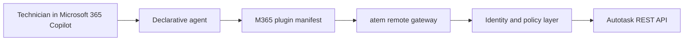
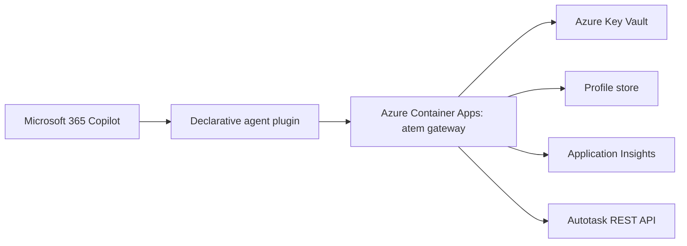

# Microsoft 365 Copilot integration spike

This note captures the first architecture pass for making `atem` available as a
tool to Microsoft 365 Copilot. It focuses on identity, write safety, and the gap
between today's local CLI/MCP server and a tenant-deployable Copilot plugin.

## Current state

- `atem mcp` exposes the command registry over MCP on stdio. This is good for
  local agents, but Microsoft 365 Copilot needs an internet-reachable runtime.
- `atem serve` now exposes a remote HTTP MCP endpoint at `/mcp`, with `/healthz`
  for container health checks.
- The hosted default toolset is `m365`, which exposes only the initial
  Copilot-safe tools.
- `atem serve --auth entra` validates Entra bearer tokens against OpenID
  discovery/JWKS, then maps `tid+oid` to a server-side technician profile.
- The registry already marks read-only and destructive commands, and all Autotask
  writes have `--dry-run`.
- Ticket creation and time logging use request-scoped `resourceId` and `roleId`
  from the authenticated profile when present, falling back to local config for
  the CLI. The user cannot pass `resourceID` directly through the existing
  `ticket create`, `timer stop`, or `time add` commands.
- The local stdio MCP surface is intentionally broader than the hosted M365
  surface. Local/admin tools such as `config set`, `company alias`, local timer
  state commands, and `config doctor` remain available locally but are hidden
  from the `m365` toolset.

## Microsoft 365 Copilot constraints

Microsoft 365 Copilot plugins can call remote MCP servers or REST APIs from a
declarative agent. Relevant docs:

- Plugins overview:
  https://learn.microsoft.com/en-us/microsoft-365/copilot/extensibility/overview-plugins
- Build from an MCP server:
  https://learn.microsoft.com/en-us/microsoft-365/copilot/extensibility/build-mcp-plugins
- Plugin manifest schema v2.4:
  https://learn.microsoft.com/en-us/microsoft-365/copilot/extensibility/plugin-manifest-2.4
- Plugin authentication:
  https://learn.microsoft.com/en-us/microsoft-365/copilot/extensibility/plugin-authentication

Important implication: API key authentication is documented for API plugins, but
not for MCP plugins. Microsoft states that MCP plugins do not support API key
authentication. For a remote MCP server, the production path should be OAuth 2.0
or Microsoft Entra ID SSO. API key auth is only a reasonable option if we expose
a REST/OpenAPI plugin instead of MCP.

## Recommended shape

Use `atem` as the core command and Autotask payload engine, but put a small
server-side policy layer in front of it:

The gateway should:

- Authenticate the caller with Microsoft Entra ID SSO or OAuth.
- Map the Entra identity server-side to an Autotask `resourceId`, `roleId`, and
  allowed scopes.
- Store Autotask API-user credentials server-side only.
- Inject `resourceID`, `roleID`, `assignedResourceID`, and
  `assignedResourceRoleID`; never accept those fields from Copilot input.
- Expose only a Copilot-safe toolset.
- Audit every attempted write with caller identity, command, payload hash,
  Autotask entity, result, and timestamp.

## Azure hosting recommendation

Host the first remote version as a containerized Go gateway on Azure Container
Apps.

Microsoft documents Azure Container Apps as a supported place to host standalone
remote MCP servers. The platform gives us public HTTPS ingress, automatic TLS,
custom domains, scaling, managed identity, optional Microsoft Entra
authentication, and standard container deployment. That matches `atem` well: it
is already a Go binary and the remote gateway can stay small while reusing the
existing command/payload code.

Recommended Azure shape:

Provision:

- Azure Container Apps for the remote MCP/REST gateway.
- Azure Container Registry for the container image.
- Azure Key Vault for Autotask API credentials and signing keys.
- Managed identity on the container app to read Key Vault and profile storage.
- A profile store for Entra-to-Autotask mappings. Azure Table Storage is enough
  for a small internal tool; Azure SQL or Cosmos DB is better if we need richer
  admin workflows and auditing queries.
- Application Insights / Log Analytics for telemetry and audit diagnostics.
- Optional Azure API Management in front when we need centralized rate limits,
  extra gateway policy, a stable public API facade, or multiple environments.

Authentication:

- Production MCP plugin: use Microsoft Entra SSO or OAuth through the Microsoft
  365 plugin auth flow. API key auth is not documented for MCP plugins.
- The gateway should validate the incoming bearer token and use `tid` + `oid`
  as the lookup key for the technician profile.
- Container Apps built-in auth can help validate Entra tokens, but the gateway
  should still enforce tenant, audience, profile lookup, scopes, and write
  policy in application code.
- First implementation supports this with:
  - `ATEM_AUTH_MODE=entra`
  - `ATEM_ENTRA_TENANT_ID`
  - `ATEM_ENTRA_AUDIENCE`
  - `ATEM_AUTH_PROFILES` or `ATEM_AUTH_PROFILE_FILE`
  - `ATEM_QUEUE_ID` and ticket status env vars for containerized defaults

Operational notes:

- Keep `minReplicas` at 1 for interactive Copilot use unless cold starts are
  acceptable.
- Expose only `/mcp` and health endpoints publicly.
- Prefer separate container app revisions/environments for dev, test, and prod.
- Use dev tunnels only for local debugging and sideloading, not production.

Alternatives:

- Azure App Service is also viable and has mature built-in auth. It is a good
  choice if we want the simplest always-on web app hosting and do not care about
  container-native rollout as much.
- Azure Functions is less attractive for the first MCP gateway because remote
  MCP tends to behave like an interactive HTTP service, and a normal container
  web server keeps the transport, auth middleware, and long-running request
  behavior easier to reason about.
- REST/OpenAPI plugin plus API key auth is possible, but then we lose the nice
  alignment with the existing MCP command registry and still must add per-user
  Entra identity server-side for write safety.

## Generic API key plus identifiers

A generic backend Autotask API user is fine if it lives only on the server and is
wrapped by policy. A generic API key sent from Copilot/client to the backend is
not enough on its own, because it does not identify the human technician.

Safe version:

- Copilot authenticates the human via Entra/OAuth.
- The backend maps `oid`/UPN to a stored technician profile.
- The backend uses one tightly-scoped Autotask API user to perform writes.
- User/resource identifiers are stored and enforced server-side.

Risky version:

- Copilot sends a shared API key plus a caller-supplied `resourceId`.
- The model or user can influence who work is assigned to or logged as.
- Audit trails become weaker because all calls look like the same shared key.

## Copilot-safe toolset

Initial remote toolset should probably include:

- `company search`
- `ticket search`
- `ticket show`
- `ticket create`
- `time add`
- `report`

Phase 1 remote toolset currently excludes:

- `config set`, `config doctor`, `config show`: tenant/server admin surface.
- `company alias`: local convenience state, not tenant policy.
- `resource search`: useful during onboarding, but not for runtime agents.
- `timer start/status/note/pause/resume/switch/stop`: currently local state.
- `ticket close`: only after ownership checks are added.
- `ui`: local interactive app.

`ticket close` can be added after the gateway verifies that the ticket is
assigned to the caller's resource, or the caller has an explicit manager/admin
scope.

## Write confirmation model

Keep `--dry-run`, but make the remote write flow explicit:

1. `*_preview` returns the exact normalized payload and a short-lived
   confirmation token.
2. The user confirms in Copilot.
3. `*_commit` accepts the confirmation token and executes the stored payload.

This prevents the model from previewing one payload and committing a subtly
different one.

Microsoft 365 plugin manifests should mark state-changing functions as
`ResourceStateUpdate` and require confirmation. Read-only functions should be
marked as `GetPrivateData`.

## Implementation phases

1. Add a Copilot-safe registry view. Done in first slice.
   - Filter tools for Microsoft 365 exposure.
   - Add tests that excluded commands never appear in the safe tool list.

2. Add remote transport and container packaging. Done in first slice.
   - `atem serve --addr :8080 --toolset m365`.
   - `/mcp` handles JSON-RPC POSTs.
   - `/healthz` supports container health checks.
   - `Dockerfile` defaults to hosted M365 mode.

3. Add request-scoped identity. Done in second slice.
   - Define a `TechnicianProfile` with Entra subject, Autotask resource ID,
     role ID, scopes, and optional company limits.
   - Make command execution use a per-request config overlay instead of global
     local config values for resource/role.

4. Add policy checks around writes. Partially done in second slice.
   - Inject resource and role fields server-side.
   - Filter tools by per-profile scopes.
   - Verify ticket ownership before close.
   - Decide whether reports default to the caller's own entries or broader
     company/project views.

5. Add packaging assets.
   - Generate or maintain `mcp-tools.json` for the safe toolset.
   - Add a plugin manifest using schema v2.4 and `RemoteMCPServer`.
   - Document local debug with dev tunnels.

## Open questions

- Should technicians see only their own time entries in `report`, or can they
  report on customer/project totals?
- Is `ticket close` a technician-only action, or should managers have broader
  close rights?
- Is tenant deployment internal only, or should the package be suitable for
  other Autotask tenants later?
- Do we want remote timers with server-side state, or should Microsoft 365
  Copilot start with explicit `time add` windows only?
